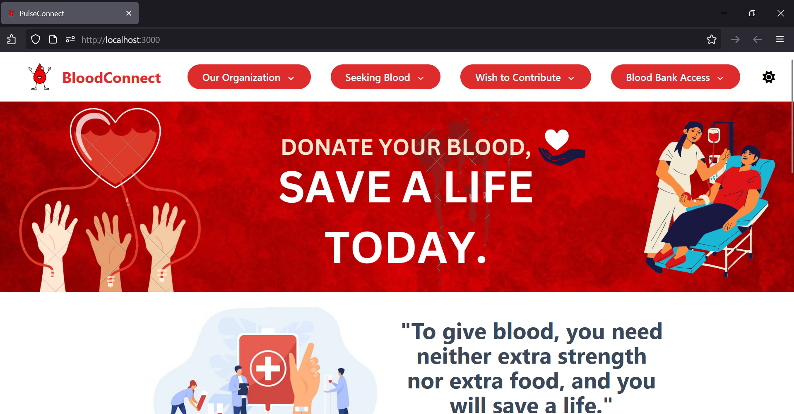
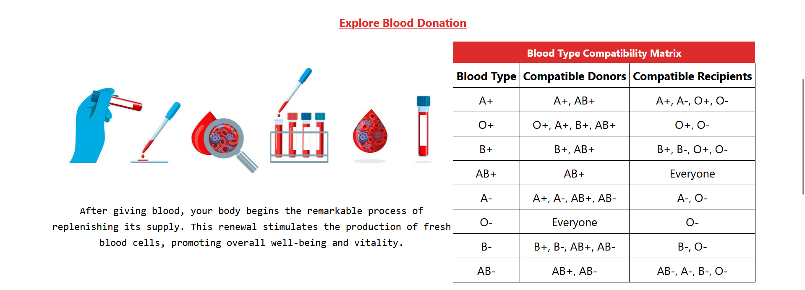
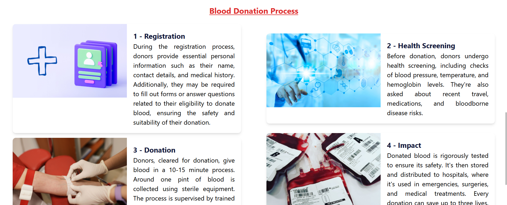

# PulseConnect

PulseConnect is a revolutionary platform designed to streamline the blood donation process, connecting donors, recipients, and blood banks with seamless efficiency. With PulseConnect, you can easily register as a donor, request blood donations, and organize or find nearby donation camps.

# Images

## Features

- **User Registration**: Register as a blood donor with ease.
- **Blood Donation Requests**: Easily request blood donations when in need.
- **Donation Camps**: Discover nearby blood donation camps and events.
- **Inventory Management**: Blood banks can efficiently manage their inventory.
- **Real-time Communication**: Secure authentication and real-time communication ensure trust and transparency.

## Getting Started

To get started with PulseConnect, follow these steps:

1. Clone this repository to your local machine.
2. Install the necessary dependencies by running `npm install`.
3. Start the development server by running `npm start`.
4. Visit [localhost:3000](http://localhost:3000) in your browser to access the PulseConnect website.

## Technologies Used

- **Frontend**: React.js
- **Backend**: Node.js, Express.js
- **Database**: MongoDB
- **Authentication**: JSON Web Tokens (JWT)

